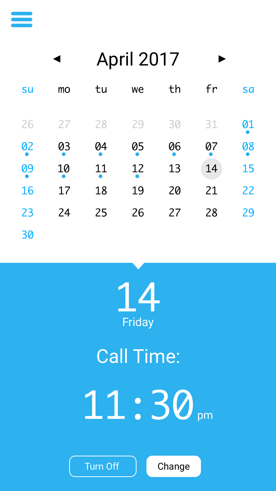
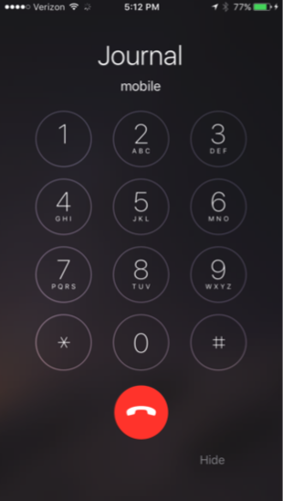

# J-Phone

J-Phone is a mobile application written in React Native. J-Phone calls you and records 60 seconds of what you have to say. This creates a quick and frictionless process to speed up the time it takes to journal. The urgency of a call allows you to never forget to journal so that you don't miss out on the benefits it has to offer.

## Calendar View

Here is where you can get a broad overview of your activity. You can set when you would like to be called and also turn off certain days if you know you will be busy.



## Logged Recording

Once you have successfully picked up the phone and talked about your day you can look back at it.


## Profile

Check out your mood breakdown and compete with friends to have the longest streak!


## Receive Calls On Your Time 

The app calls you and you get the opportunity to talk about your day for 60 seconds. On top of this you can rate your day 1-10 followed by the pound sign.




## Getting Started

### Installing

```
git clone https://github.com/jacobhammerle/j-phone
```

```
npm install
```

## License

This project is licensed under the MIT License